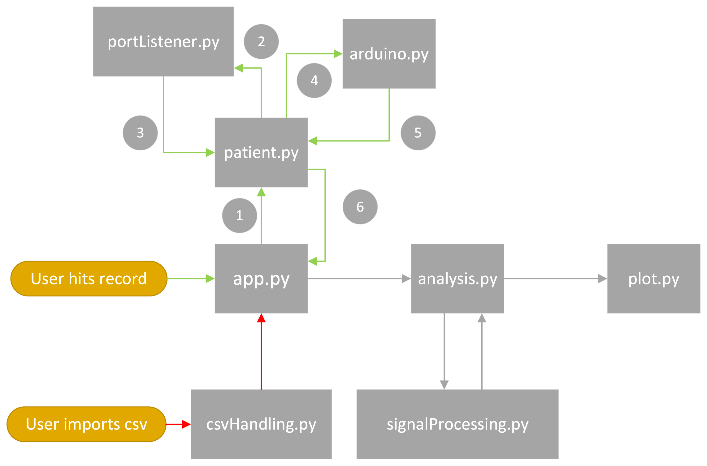

# EssentialTremour Diagnostic Device

> This README contains documentation for the project

## Contents

- [Project Structure](#project-structure)
    - [When the user hits record](#when-the-user-hits-record)
    - [When the user imports a csv file](#when-the-user-imports-a-csv-file)
    - [Universally](#universally)
- [Classes and Methods](#classes-and-methods)
    - [`app.py`](#apppy)
        - [`getCsv()` method](#getcsv-method)
        - [`patientRecordOnClick()` method](#patientrecordonclick-method)
    - [`patient.py`](#patientpy)
        - [`recordPatient()` method](#recordpatient-method)
            - [`__returnPatient()` helper method](#__returnpatient-helper-method)
            - [`__recordingTimer()` helper method](#__recordingtimer-helper-method)
            - [`__countdown()` helper method](#__countdown-helper-method)
            - [`__record()` helper method](#__record-helper-method)
        - [`getData()` method](#getdata-method)
        - [`getTime()` method](#gettime-method)
    - [`portlistener.py`](#portlistenerpy)
        - [`findArduino()` method](#findarduino-method)
        - [`noArduino()` method](#noarduino-method)
    - [`arduino.py`](#arduinopy)
        - [`read()` method](#read-method)
    - [`csvHandling.py`](#csvhandlingpy)
        - [`read()` method](#read-method-1)
        - [`readingTime()` method](#readingtime-method)
    - [`signalProcessing.py`](#signalprocessingpy)
        - [`applyFourierTransform()` method](#applyfouriertransform-method)
            - [`__normaliseSpectrum()` helper method](#__normalisespectrum-helper-method)

## Project Structure

> The above is a basic flow of the application, below describes it in detail

### When the user hits record

1. In `app.py` a new `patient` object is created.
2. The `patient` object then calls `portlistener.py` which then find the **port** of the arduino.
3. The **port** is returned to the `patient` object.
4. An `arduino` object is created by a helper method in the `patient` class.
5. The `arduino` object stores the data being received by the serial port for the specified amount of time. This is then read into a `pandas Dataframe` object and stored in the patient object.
6. `app.py` can then use the data and time values from the patient object for further processing.

### When the user imports a csv file

- `app.py` calls `csvHandling.py` which both returns the data in a `pandas Dataframe` and deciphers the title to return the how long the run was

### Universally

- `analysis.py` will then use `signalProcessing.py` to data, extracting the relevant info.
- `analysis.py` will then use `plot.py` which utilises `matplotlib` to plot the data.
    - `matplotlib.axes.Axes.psd()` plots the power spectral density of the data. Returns the power spectral density and the frequencies (to be used for processing - maybe move this to `signalProcessing.py`). See documentation - [matplotlib.axes.Axes.psd()](https://matplotlib.org/stable/api/_as_gen/matplotlib.axes.Axes.psd.html)
    - `matplotlib.axes.Axes.csd()` should be used to plot the cross spectral density of the data. Returns the cross spectral density and the frequencies (to be used for processing - maybe move this to `signalProcessing.py`). See documentation - [matplotlib.axes.Axes.csd()](https://matplotlib.org/stable/api/_as_gen/matplotlib.axes.Axes.csd.html#matplotlib.axes.Axes.csd)

## Classes and Methods

### `app.py`

- Does all the graphical user interface stuff

#### `getCsv()` method

- Brings up file dialog to select csv to be imported
- creates a `csvHandling` object using the selected file
- uses the onject to return the data and time
- currently creates a `plot` object to plot the data - this should be changed to an `analysis` object which will will then do the relevant processing and plotting

#### `patientRecordOnClick()` method

- creates a `patient` object
- calls the objects `recordPatient()` method
- currently creates a `plot` object to plot the data - this should be changed to an `analysis` object which will will then do the relevant processing and plotting

---

### `patient.py`

- defines the patient object which is used whenever a patient recording happens

#### `recordPatient()` method

- takes in patient name and time to record for
- calls the `__returnPatient()` helper method

##### `__returnPatient()` helper method

- stores the entered patient name and time in the object
- calls the `__recordingTimer()` helper method

##### `__recordingTimer()` helper method

- calls the `__countdown()` helper method and `__record()` helper method in a multithreading method of operation (so that the timer runs while the recording is taking place)

##### `__countdown()` helper method

- displays a countdown timer to the user

##### `__record()` helper method

- creates a `portListener` object, which returns the port of the arduino
- creates an `arduino` object, which stores the data from the arduino in a `pandas Dataframe` object

#### `getData()` method

- returns data recorded for use elsewhere

#### `getTime()` method

- returns time recorded for use elsewhere

---

### `portlistener.py`

- defines the `portListener` object which is used to find the port of the arduino

#### `findArduino()` method

- iterates through all the ports on the computer, searching for the name of the arduino, if found returns the port, if not returns the `noArduino` method

#### `noArduino()` method

- returns an error message to the user, stating that no arduino was found

---

### `arduino.py`

- handles the data from the arduino

#### `read()` method

- reads the data received from the serial port into a csv file

---

### `csvHandling.py`

- handles the data from the csv file

#### `read()` method

- reads the data from the csv file into a `pandas Dataframe` object

#### `readingTime()` method

- reads the title of the csv file to return the time the recording was for

---

### `analysis.py`

- needs to be completed, will handle the processing of the data

---

### `plot.py`

- handles creating plots of the data

#### `createPatientPlot()` method

- currently calls the `__originalSignal()` helper method and the `__transformedSignal()` helper method to create a plot of the original signal and the transformed signal

##### `__originalSignal()` helper method

- plots the original signal

##### `__transformedSignal()` helper method

- plots the power spectral density of the original signal

---

### `signalProcessing.py`

- all signal processing methods should be defined here

#### `applyFourierTransform()` method

- returns the shifted frequency amplitude spectra of the data

##### `__normaliseSpectrum()` helper method

- was previously used to normalise the data by only returning the top 90% of frequency peaks, but this is being abandoned in favour of a cross spectral density analysis, comparing a basline not tremour signal to the patients signal or an imported csv file of a signal